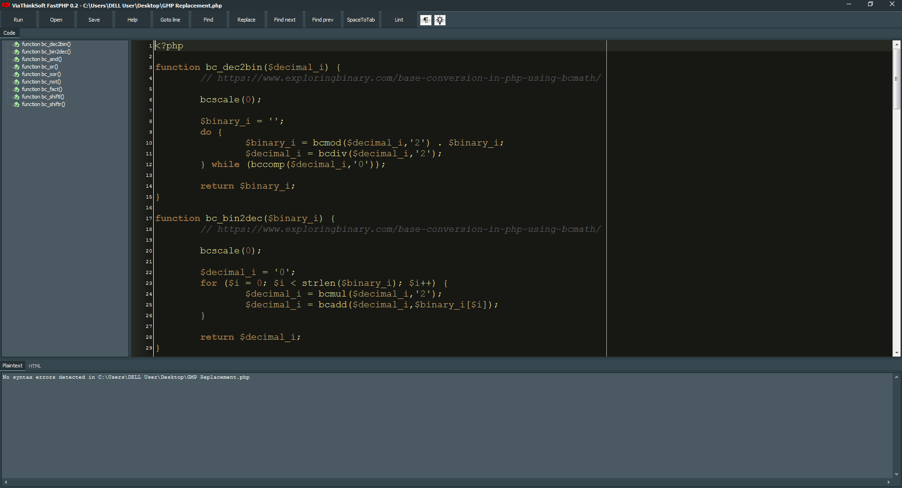
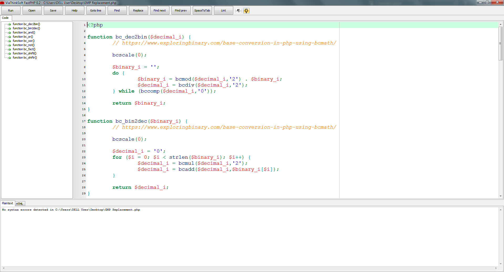

# ViaThinkSoft FastPHP - Code Editor for PHP

FastPHP is a simple, efficient, and comfortable editor/IDE for PHP. Besides syntax highlighting, a code explorer, and the execution of PHP scripts outside the browser, FastPHP offers other useful functionalities like PHP Lint, showing the PHP documentation by keystroke and automatic replacement of whitespaces into tabs.

Features:
- Loads very fast, similar to Notepad
- Syntax highlighting
- Code TreeView Explorer (written in PHP!), also shows TODO-Entries
- Running PHP files without IDE and without browser
- Integrated PHP lint
- Conversation from whitespaces to tabs
- Integrated PHP help with the F1 key
- PHP files can be executed like HTA files via double-click
- Switch between Dark and Light theme
- Show/Hide formatting symbols
- Clicking on a PHP error will jump to the code line
- Automatically removes unnecessary spaces at end of lines and the end of file
- Integrate in Explorer as "Shell new" to quickly create new PHP files

** Download FastPHP for Windows here: https://www.viathinksoft.com/projects/fastphp **

## Shortcuts

- Ctrl+F: Find
- Ctrl+H: Replace
- F3: Find next
- Shift+F3: Find previous
- Ctrl+G: Go to line #
- Ctrl+S: Save
- Shift+Ctrl+S: Save as...
- Shift+Ctrl+L: Lint
- Shift+Ctrl+T: Space-to-Tab
- F1: Get help about selected word
- F9: Run script
- Shift+F9: Run script in console
- ESC: Close help page and go back to code
- Ctrl+O: Open file in new window
- Left mouse + scroll mouse: Scale font up/down
- Tab (on selection): Increase indent
- Shift + Tab (on selection): Decrease indent
- Right click on the "Run" button opens:
	* Run
	* Run in console
	* Go to PHP dir (e.g. to edit php.ini)
	* PHP Interactive Shell
- Right click on the "Save" button opens:
	* Save
	* Save as...

## Example screenshot

